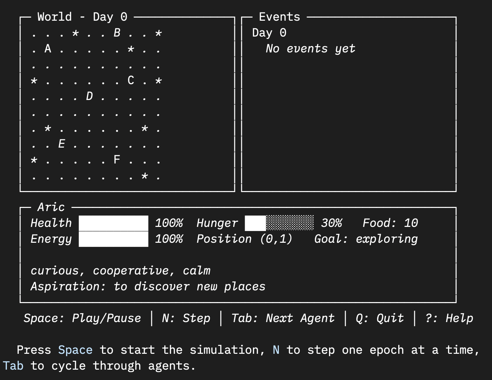

<div align="center">

<h1 align="center">
  
  <br>
  Terrarium
</h1>

<p align="center">
  <em>A societal simulation engine where LLM-powered agents form emergent civilizations.</em><br>
  <em>Watch societies evolve from simple rules.</em>
</p>

<p align="center">
  <a href="https://www.rust-lang.org/">
    
  </a>
  <a href="https://www.anthropic.com/claude">
    
  </a>
  <a href="LICENSE">
    
  </a>
</p>

<p align="center">
  <a href="docs/CONCEPT.md">Concept</a> •
  <a href="docs/ARCHITECTURE.md">Architecture</a> •
  <a href="docs/MVP.md">MVP Scope</a> •
  <a href="docs/TUI.md">TUI Viewer</a>
</p>

<hr />

</div>

Terrarium is a **societal petri dish**. You create a world with rules, populate it with autonomous agents (each powered by an LLM), and observe what emerges.

Each agent has:
- **Personality**: Stable traits that bias behavior
- **Beliefs**: Updateable, possibly wrong, shaped by experience
- **Needs**: Hunger, energy—survival pressure
- **Memory**: What happened to them, what they think of others

You don't program markets, hierarchies, or alliances. You watch for them.

---

## The Core Question

> Can we observe the organic emergence of social structures by giving agents freedom within constraints?

---

## Quick Start

```bash
# Build
cargo build --release

# Run headless (batch mode)
./target/release/terrarium --scenario scenarios/first_winter.toml

# Run with TUI viewer (Dwarf Fortress-style)
./target/release/terrarium --scenario scenarios/first_winter.toml --tui

# Read the narrative
cat output/chronicle.md
```

---

## TUI Viewer

A Dwarf Fortress-inspired terminal viewer with modern keybindings.

<p align="center">
  
</p>

| Key | Action |
|-----|--------|
| `Space` | Pause / Resume |
| `N` | Step one epoch (when paused) |
| `Tab` | Cycle agents |
| `Arrows` | Select adjacent agent |
| `1-9` | Jump to agent by number |
| `+/-` | Speed up / slow down |
| `?` | Help |
| `Q` | Quit |

---

## Design Principles

- **Beliefs, not facts**
  Agents have beliefs that can be wrong. They learn from experience, form opinions about others, and can be deceived or mistaken.

- **Property as belief**
  There is no property enforcement mechanic. If an agent believes something is theirs, that's their belief. Violence is the arbiter.

- **Daily epochs, simultaneous resolution**
  All agents decide based on the same frozen world state. Actions resolve together, creating fair conflict mechanics.

- **Event sourcing**
  Every action becomes an immutable event. Perfect for replay, analysis, and generating narratives.

---

## Key Decisions

| Decision | Choice |
|----------|--------|
| Agent knowledge | Beliefs, not facts (agents can be wrong) |
| Property | Belief only, no enforcement (violence is arbiter) |
| Time | Daily epochs, simultaneous resolution |
| Observation | Event sourcing, post-hoc analysis |
| Scale | Start with tribe (10), validate, then grow |

---

## MVP Scope

- **10 agents** with full cognitive model
- **10x10 grid** with fertile/barren terrain
- **7 actions**: move, gather, eat, rest, speak, give, attack
- **100 epochs** of simulation
- **Output**: Event logs + human-readable chronicle + TUI viewer

Goal: Validate that the model produces interesting, coherent dynamics.

---

## Cognitive Architecture

```
IDENTITY (stable)
├── Personality traits (Big Five simplified)
├── Core values
└── Life aspirations
        │
        ▼
BELIEF SYSTEM (updates from experience)
├── World beliefs ("the forest has food") — can be wrong
├── Social beliefs ("Bria is trustworthy") — can be wrong
├── Self beliefs ("I am a good hunter") — can be deluded
└── Causal beliefs ("sharing leads to reciprocity") — can be naive
        │
        ▼
WORKING STATE (current tick)
├── Perception (what's visible now)
├── Active goal (what I'm trying to do)
├── Recent events (last few ticks)
└── Physical state (hunger, energy, health)
        │
        ▼
ACTION (low-level)
└── move, gather, eat, speak, give, attack, rest
```

---

## What Might Emerge?

We don't know. That's the point. Possibilities:

- **Trade networks** — reciprocal exchange patterns
- **Property norms** — respected territorial claims
- **Hierarchies** — asymmetric deference relationships
- **Alliances** — coordinated group action
- **Reputations** — beliefs about others spreading via gossip
- **Conflict patterns** — scarcity-driven or personality-driven

---

## Inspirations

- *Dwarf Fortress* — emergent narratives from simple systems
- *Conway's Game of Life* — complexity from minimal rules
- *Guns, Germs, and Steel* — geography shaping civilization
- Agent-based modeling in computational social science

---

## Documentation

| Document | Description |
|----------|-------------|
| [Concept](docs/CONCEPT.md) | Vision, philosophy, inspirations |
| [Architecture](docs/ARCHITECTURE.md) | Technical design, cognitive model, simulation loop |
| [MVP](docs/MVP.md) | Current scope and success criteria |
| [Observer Protocol](docs/OBSERVER_PROTOCOL.md) | Client interface for viewers |
| [TUI](docs/TUI.md) | Terminal viewer specification |

---

## License

MIT
